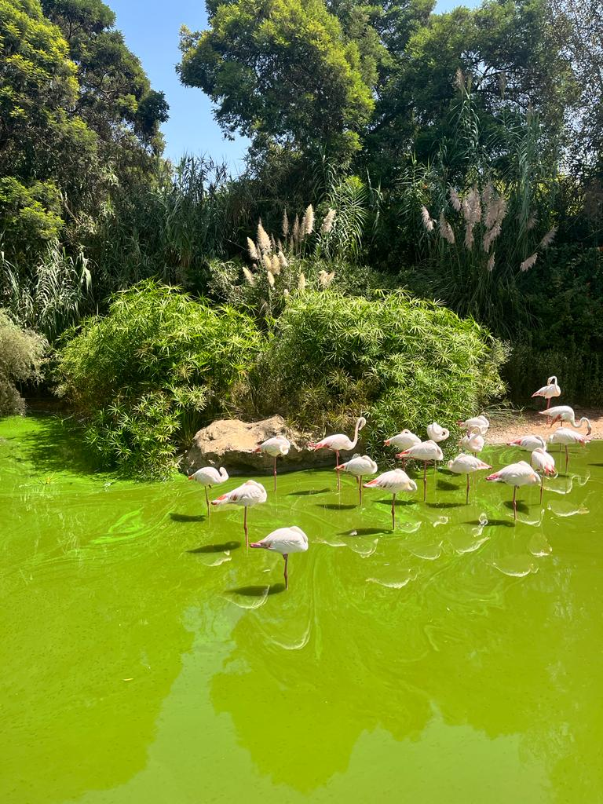

<head>
    <meta http-equiv="Content-Type" content="text/html; charset=UTF-8">
    
    <meta name="viewport" content="width=device-width, initial-scale=1.0">
    <title>Portfolio de Photographie
    </title>
    
   
</head>

<body>
    <!-- En-tête de la page -->
    <header>
        <h1>Mon Portfolio de Photographie</h1>
        
Explorez l'essence de moments capturés, saisis à travers le regard unique de mon objectif photographique.

    </header>
    <!-- Conteneur pour la barre de défilement et la galerie -->
     

        

            

                

                    
                    

                    
Sous le Toit d'une Canopée Florissante

                

                

                    
                    

                    
La fontaine, dépourvue d'eau, repose telle une sculpture d'éclat minéral dans le jardin

                

                

                    
                    

                    
Ballet des Flamants.

                

                

                    
                    

                    
Maison Douillette.

                

                

                    
                    

                    
À la rencontre du monde fascinant des singes.

                

                

                    
                    

                    
L'Élégance Imposante des Éléphants.

                

                

                    
                    

                    
Les Oiseaux en Harmonie dans le Ciel.

                

                

                    
                    

                    
La Beauté Intemporelle d'un Oiseau.

                

                

                    
                    

                    
Élégance et Couleurs Vibrantes.

                

                

                    
                    

                    
Les Arbres, Gardiens du Temps.

                

            

        

    

    <!-- Pied de page -->
    <footer>
        
© 2023 Mon Portfolio de Photographie

    </footer>
    
    
    <!-- Ajoutez ce paragraphe à l'intérieur du corps de votre document, sous la section de la galerie -->
<!-- Nouvelle section pour l'introduction professionnelle -->

    

        En tant que photographe passionné, j'ai développé une affinité particulière pour capturer la beauté éphémère de la nature.
        Mon objectif est de figer ces moments uniques et de les partager avec le monde, capturant l'essence même de la vie à travers mon objectif.
        Explorez mon portfolio et plongez dans un monde où chaque image raconte une histoire. C'est par amour pour ce domaine que je participe à ce concours.
    

    <!-- Script JavaScript -->
    
    <!-- Concours -->
    

        <h2>Participez à notre concours et gagnez un shooting gratuit !</h2>
        
Remplissez le formulaire ci-dessous pour participer :

      

        <form>
            <label for="first-name">Prénom: <input type="text" id="first-name" name="first-name" required=""></label>
        
            <label for="last-name">Nom: <input type="text" id="last-name" name="last-name" required=""></label>
        
            <label for="email">Email: <input type="email" id="email" name="email" required=""></label>
        
            <label for="gender">Genre:
                <input type="radio" id="female" name="gender" value="female">
                Femme
                <input type="radio" id="male" name="gender" value="male">
                Homme
            </label>
        
            <input type="submit" value="Participer au concours">
        </form>
        

    

    <!-- Compte à rebours -->
    
Temps restant : 2 jours, 23 heures, 59 minutes, 37 secondes

<!-- Ajoutez ces styles à la section 

    <!-- Script JavaScript -->
    

</body></html>
